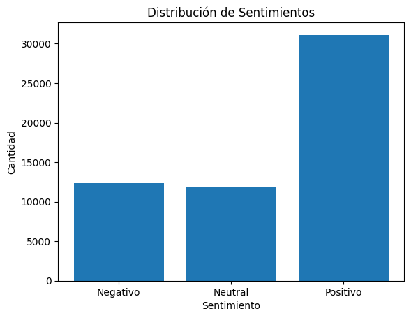

# <h1 align=center> **PROYECTO INDIVIDUAL Nº1** </h1>

# <h1 align=center>**`Exploratory Data Analysis`**</h1>

En el siguiente análisis, nos adentraremos en el desarrollo de un modelo de Machine learning (MLops), el cual debe pasar antes por un paso a paso de diferentes etapas, por ejemplo ETL, conversión de datos, análisis exploratorio de los datos y realización del modelo solicitado

*Aclaraciones:* se modificó el archivo original .json, dejándolo en .parquet, para poder realizar el commit a nuestro repositorio sin problemas de memoria.

Se realizaron algunas conversiones de tipo de dato con la extensión data wrangler, así como renombramiento de columnas o eliminacion de algunos datos que manualmente nos fue imposible realizar.

### *Importante*
### Se realizó el reemplazo de los archivos .json en los datasets originales debido a problemas de memoria con Github
### Nuestro modelo de ML de recomendación_juego por id_game, devuelve 5 id's de recomendación

***Enlace para render*** 
https://pimlopsgc.onrender.com/

De encontrar errores al abrir el jupyer notebook por la importacion de módulos, utilizar un entorno normal, se resolvió el problema de espacio de memoria, deployando todo desde un entorno virtual sin librerías instaladas, ya que render al realizar el BuildUp, instala las librerías necesarias.
En nuestro archivo Requeriments.text, se dejaron los nombres de las librerias utilizadas en éste trabajo, pero cuidado, una gran instalación de librerias que no utilicemos puede derivar en fallos de memoria para render

### Índice 

- [Output_steam_games](#Output_steam_games)
- [Australian_user_reviews](#Australian_user_reviews)
- [Sentiment_Analysis](#Sentiment_Analysis)
- [Australian_user_items](#Australian_user_items)
- [Video](#video)
- [Autor:](#Autor)

# Output_steam_games

Al abrir nuestro archivo *output_steam_games*, observamos que la cantidad de nulos representa más del 70% de nuestros datos totales, con lo cual procedimos a eliminar con (how='all') solo los nulos que en sus filas abarcan el total de columnas.

**Cantidad de nulos por columna**
publisher :      96362,
genres:          91593,
app_name:        88312,
title:           90360,
url:             88310,
release_date:    90377,
tags:            88473,
reviews_url:     88312,
specs:           88980,
price:           89687,
early_access:    88310,
id:              88312,
developer:       91609

Después de realizar ésta eliminación de nulos, renombramos las diferentes columnas que posee nuestro dataset df_steam_games para poder tenerlo más ordenado y verficamos de vuelta nuestra *cantidad de nulos*: 

publisher       8051,
genres          3282,
item_name          1,
title           2049,
url                0,
release_date    2066,
tags             162,
reviews_url        0,
specs            669,
price           1377,
early_access       0,
item_id            0,
developer       3298

Luego de revisar nulos y duplicados, encontramos datos faltantes en genres, pero encontramos similitud con la columna tags, la cual poseía géneros del juego observado, procedemos a realizar una funcion que tome como indice los valores unicos en géneros, para iterar por fila en tags y rellenar los valores faltantes en genres, luego procedimos a eliminar tags y eliminar datos en genres como "early_acces" o "free to play" ya que no son considerados generos

# Australian_User_reviews

*Columnas al abrir nuestro archivo*
***user_id,	user_url,	reviews***

éstas son las columnas que nos quedan una vez desanidado reviews, procedemos a eliminar la columna "0", "helpful", "last_edited" y "funny" que son irrelevantes para nuestro análisis, encontrandonos con mucha felicidad que no poseemos nulos en esta instancia 

## ***user_id	,user_url	,funny	,posted	,last_edited	,item_id	,helpful	,recommend	,review,	0***
Luego, rellenamos la columna "year" con la media para poder sacar los valores faltantes, ésta columna es relevante para nuestro analisis y modelado futuro de datos, por lo tanto utilizamos .median en year

Podemos observar con wordcloud, las palabras más utilizadas en nuestra columna review, para poder observar de manera indirecta la futura alineación de sentimientos 

Tambien observamos la columna recommend para comparar

# Sentiment_Analysis 

Para nuestro análisis de sentimiento, utilizamos la libreria NLTK, la cual, con sentiment_vader, explora las reviews analizando el texto y devuelve valores como 0,1,2, en los cuales 2 es positivo, 1 es neutral(el cual tambien puede ser contemplado para usuarios que no dejaron reseña) y 0 para negativo, añadiendo la columna "sentiment_analysis" para nuestro dataset

Acá podemos observar la cantidad de sentimientos en el total de reviews, siendo más positivos que negativos y neutros

***sentiment_analysis***
***2 :   33524,***
***1  :  13062,***
***0   : 12747***

Seguido a lo realizado, procedemos a eliminar duplicados y nulos, que para nuestra grata sorpresa eran bastante pocos y pudimos continuar al siguiente dataset, obteniendo user_reviews de esta manera:
## 'user_id',	'user_url',	'item_id'	,'recommend',	'year',	'sentiment_analysis'

# Australian_user_items

Al abrir nuestro dataset, nos encontramos con las siguientes columnas: 
*'user_id'*	*'items_count'*	*'steam_id'*	*'user_url'*	*'items'*

observamos que items está anidado, por lo cual procedemos a desanidarlo y concatenarlo con nuestro dataframe original df_items, nos quedaría asi: 

***'item_id'	'item_name'	'playtime_forever'	'playtime_2weeks'	'user_id'	'items_count'	'steam_id'	'user_url'***
los cuales tienen la siguiente cantidad de nulos:

item_id:               16806,
item_name:             16806,
playtime_2weeks:       16806,
playtime_forever:      16806,
user_id:             5081705,
items_count:         5081705,
steam_id:            5081705,
user_url:            5081705

luego de realizar los cambios pertinentes para tipos de dato de cada columna y limpiar los datos en playtime forever, eliminando jugadores que no poseen horas de juego, los cuales son irrelevantes para el analisis, nuestras columnas quedaron de esta manera:

item_id             112
item_name           112
playtime_2weeks     112
playtime_forever    112
user_id               0
items_count           0
steam_id              0
user_url              0

Al observar que había user_id que no poseía juegos (112 user_id diferentes) elegí eliminar directamente esos nulos con un dropna 

Acá podemos observar la cantidad de horas jugadas por género en cuanto a una suma total de todos los usuarios

**`Desarrollo API`**:   Propones disponibilizar los datos de la empresa usando el framework ***FastAPI***. Las consultas que propones son las siguientes:

 Debes crear las siguientes funciones para los endpoints que se consumirán en la API, recuerden que deben tener un decorador por cada una (@app.get(‘/’)).

+ def **PlayTimeGenre( *`genero` : str* )**:
    Debe devolver `año` con mas horas jugadas para dicho género.
  
Ejemplo de retorno: {"Año de lanzamiento con más horas jugadas para Género X" : 2013}

+ def **UserForGenre( *`genero` : str* )**:
    Debe devolver el usuario que acumula más horas jugadas para el género dado y una lista de la acumulación de horas jugadas por año.

Ejemplo de retorno: {"Usuario con más horas jugadas para Género X" : us213ndjss09sdf,
			     "Horas jugadas":[{Año: 2013, Horas: 203}, {Año: 2012, Horas: 100}, {Año: 2011, Horas: 23}]}

+ def **UsersRecommend( *`año` : int* )**:
   Devuelve el top 3 de juegos MÁS recomendados por usuarios para el año dado. (reviews.recommend = True y comentarios positivos/neutrales)
  
Ejemplo de retorno: [{"Puesto 1" : X}, {"Puesto 2" : Y},{"Puesto 3" : Z}]

+ def **UsersWorstDeveloper( *`año` : int* )**:
   Devuelve el top 3 de desarrolladoras con juegos MENOS recomendados por usuarios para el año dado. (reviews.recommend = False y comentarios negativos)
  
Ejemplo de retorno: [{"Puesto 1" : X}, {"Puesto 2" : Y},{"Puesto 3" : Z}]

+ def **sentiment_analysis( *`empresa desarrolladora` : str* )**:
    Según la empresa desarrolladora, se devuelve un diccionario con el nombre de la desarrolladora como llave y una lista con la cantidad total 
    de registros de reseñas de usuarios que se encuentren categorizados con un análisis de sentimiento como valor. 

Ejemplo de retorno: {'Valve' : [Negative = 182, Neutral = 120, Positive = 278]}

*Modelo de Recomendación*

+ def **recomendacion_juego( id de producto )**: Ingresando el id de producto, deberíamos recibir una lista   con 5 juegos recomendados similares al ingresado.

Éste análisis de inicio, tanto como la parte de desarrollo de nuestros datos en crudo y nuestro EDA, contextualizan todos los objetivos presentados por la empresa Steam Games, esperamos haya sido de su agrado.

# Autor:
***Gerardo José Cortijo Regalo***

*Opciones de contacto*

+ [GitHub](https://github.com/Gerard175dnb)

+ [Linkedin](https://www.linkedin.com/in/gerardocor175/)
